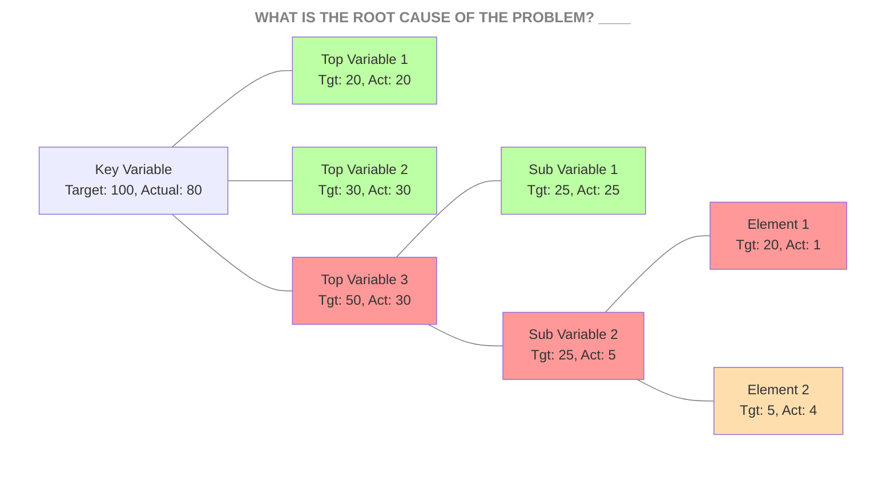
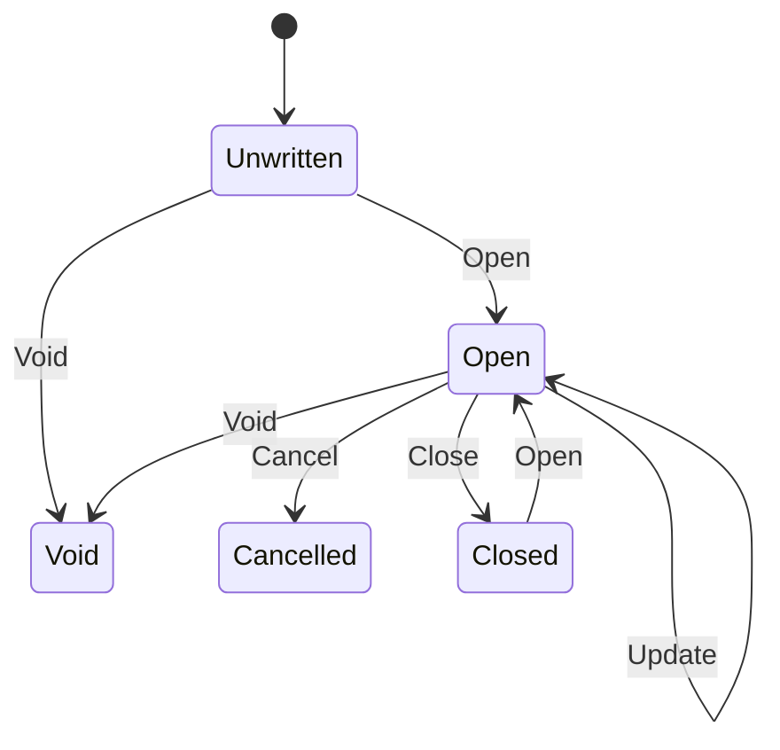
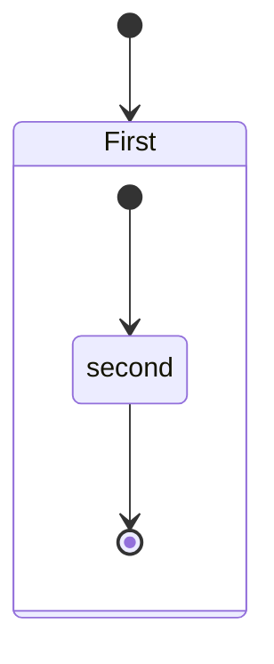
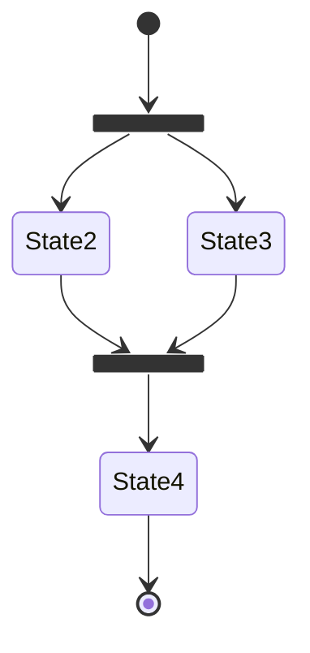
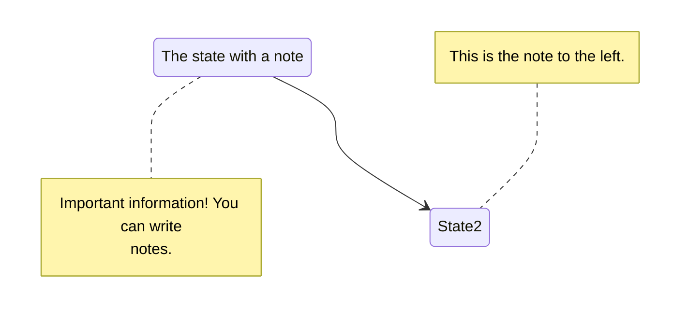
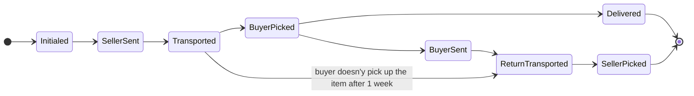

# Notes
NotesHub Notebook
 *some emphasized markdown text*

```mermaid
graph TD
%% Adding a title to the flowchart using the SubGraph feature
subgraph SGTitle ["WHAT IS THE ROOT CAUSE OF THE PROBLEM? ____"]

%% Nodes
    0[Key Variable<br>Target: 100, Actual: 80]
    1[Top Variable 1<br>Tgt: 20, Act: 20]
    2[Top Variable 2<br>Tgt: 30, Act: 30]
    3[Top Variable 3<br>Tgt: 50, Act: 30]
    31[Sub Variable 1<br>Tgt: 25, Act: 25]
    32[Sub Variable 2<br>Tgt: 25, Act: 5]
    321[Element 1<br>Tgt: 20, Act: 1]
    322[Element 2<br>Tgt: 5, Act: 4]
    
%% Close title subgraph
end
    
%% Links
    0 --- 1
    0 --- 2
    0 --- 3
    3 --- 31
    3 --- 32
    32 --- 321
    32 --- 322
    
%% Defining node styles
    classDef Red fill:#FF9999;
    classDef Amber	fill:#FFDEAD;
    classDef Green fill:#BDFFA4;

%% Assigning styles to nodes
    class 3,32,321 Red;
    class 322 Amber;
    class 1,2,31 Green;
    
%% Changing color of links [NOTE: Link arrows will remain black]
    linkStyle default fill: none, stroke: grey;
    
%% Styling the title subgraph

    classDef Title fill:#FF99FF00, stroke-width:0, color:grey, font-weight:bold, font-size: 17px;
    class SGTitle Title;
```

```mermaid
stateDiagram-v2
  [*] --> Unwritten
  
  Unwritten --> Open: Open
  Unwritten --> Void: Void
  
  Open --> Void: Void
  Open --> Cancelled: Cancel
  Open --> Closed: Close
  Open --> Open: Update
  
  Closed --> Open: Open
```

```mermaid
stateDiagram-v2
    [*] --> First
    state First {
        [*] --> second
        second --> [*]
    }
```

```mermaid
 stateDiagram-v2
    state fork_state <<fork>>
      [*] --> fork_state
      fork_state --> State2
      fork_state --> State3

      state join_state <<join>>
      State2 --> join_state
      State3 --> join_state
      join_state --> State4
      State4 --> [*]
```

```mermaid
stateDiagram-v2
        State1: The state with a note
        note right of State1
            Important information! You can write
            notes.
        end note
        State1 --> State2
        note left of State2 : This is the note to the left.
```

## Shipment Status

```mermaid
stateDiagram-v2 
  direction LR
  [*] --> Initialed
  Initialed --> SellerSent
  SellerSent --> Transported
  Transported --> BuyerPicked
  BuyerPicked --> Delivered
  Delivered --> [*]
  
  BuyerPicked --> BuyerSent
  BuyerSent --> ReturnTransported
  ReturnTransported --> SellerPicked
  SellerPicked --> [*]
  
  Transported --> ReturnTransported: buyer doesn'y pick up the item after 1 week
```