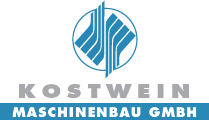

# Kostwein

## Veeam

- [PSVeeamDashboard](<https://github.com/KOWThamielis/KOWVeeamDashboard>)
  > Mit PowerShell erstellte Veeam Dashboards
- [PSVeeamKOW](<https://github.com/Thamielis/PSVeeamKOW>)
  > Veeam Module import und Credentials

## ActiveDirectory

  - [ ] [13.05.2025] Automatische Mail überprüfen
  - [ ] [13.05.2025] PC User im AD deaktivieren.

### [Sync-Sage2AD](<https://github.com/KOWThamielis/Sync-Sage2AD>)
  > Synchronisation der Sage Daten zu ActiveDirectory
  >> :bangbang: [PSActionPacks](<https://github.com/Thamielis/PSActionPacks>)
  >>
  >> :warning: [Employee Klasse](<https://github.com/Stephanevg/PowerShellClassesSeries2/blob/master/Employee_part5.ps1>)

## MECM

### [PSTaskSequenceReport](<https://github.com/KOWThamielis/PSTaskSequenceReport)>)
  > 📝 Builds a HTML Report of MECM TaskSequence deployment, with detailed steps and results of each device
  
### [MECM_TS](https://github.com/Thamielis/MECM_TS)
  > 📝 Tasksequenz auslesen und visualisieren

### [DriverPackages](https://github.com/In-Pro-Org/DriverPackages)
  > 📝 MECM for DELL Bios and Driver Package Management

---

## Projekte

### PowerShell

#### Sync-Sage2AD

### Veeam
  Projektverantwortlicher

### MECM

### CI-Sign
  > 📝 Signaturen erstellen, verwalten und ändern

#### Standard Mitarbeiter Signaturen
  > Derzeit werden die Signaturen über die OU des entsprechenden Mitarbeiters, zugeteilt.
  > Dadurch, dass es eine geteilte OU Struktur gibt, bekommen Mitarbeiter, welche nicht in der Alten
  > Struktur angelegt sind, keine zugeteilt.

  - [X] AD Gruppen für jeden Standort erstellen
  - [ ] In CI-Sign die Zuteilung über diese Gruppen hinzufügen
  - [ ] Sync-Sage2AD für die Zuteilung erweitern
  - [ ] In ARM die Zuteilung einbinden

